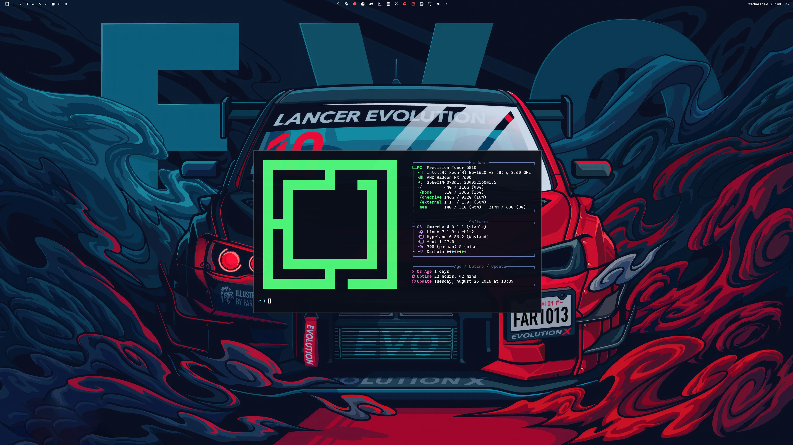
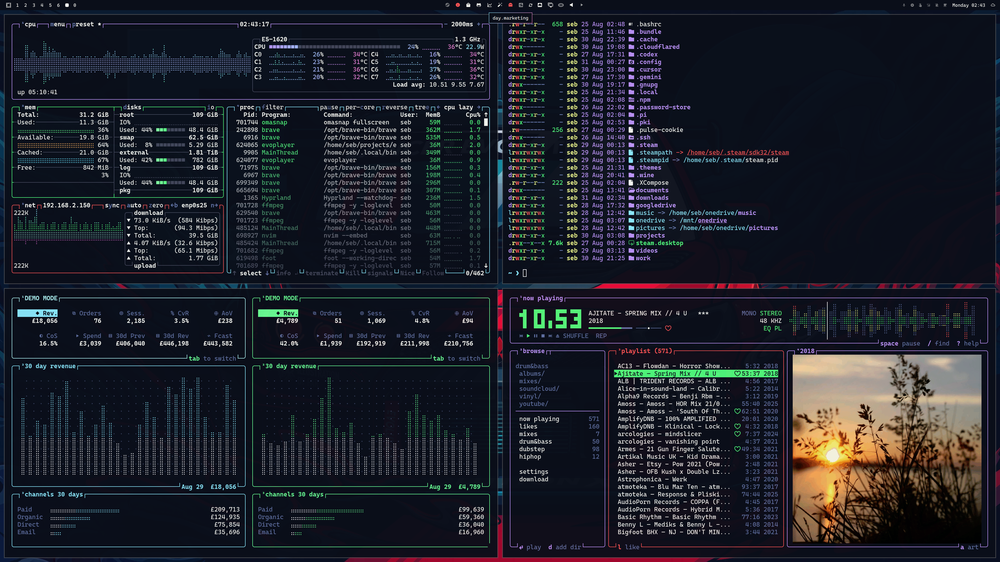

# Omarchy dots

  


Personal Omarchy overrides: quad-monitor layout, Brave/file-manager bindings, numpad workspaces, capture scripts, OrangeMonkey web CSS, and shell aliases.

## Install

```bash
git clone git@github.com:sebday/hyprdots.git ~/projects/hyprdots
cd ~/projects/hyprdots
git checkout omarchy
./install.sh
```

Web CSS needs `darkhttpd` (`pacman -S darkhttpd`). Install the OrangeMonkey userscript once from:

```
http://localhost:8008/shared/orangemonkey-theme-reloader.js
```

**Fonts (GTK apps):** `omarchy font set` only updates fontconfig (bar, terminals). Nautilus and other GTK apps use `gsettings font-name` — synced by `.config/omarchy/hooks/font-set.d/gtk-font.hook` into `~/.config/gtk-3.0/settings.ini` and `gtk-4.0/settings.ini`.

**Brave:** stock Omarchy `BrowserThemeColor` policy via `omarchy-theme-set-browser` (not GTK).

**Files (Nautilus):** `gtk-css-apply.sh` writes only the libadwaita palette (`libadwaita-gtk.css`, ~4KB) to `gtk.css`. The Nautilus extension reloads that palette from `current/theme` on `SIGUSR1`. 

**Themes:** light themes (`mode = "light"` in `colors.toml`) are hidden from the bar theme picker and `omarchy-theme-cycle`. 

**Default agent:** `a` / `omarchy agent` launch [Cursor Agent](https://cursor.com) via wrappers in `.local/bin/omarchy-agent` and `omarchy-default-agent` (set in Setup → Agent → Cursor). Uses `agent --force` for unattended mode.

**Neovim:** `install.sh` links `.config/nvim`.

## Packages

Slim-down from stock Omarchy (Aug 2026). Lists live in [`.install/packages-removed.txt`](.install/packages-removed.txt) and [`.install/packages.txt`](.install/packages.txt).

```bash
.install/packages.sh show      # dry-run summary
.install/packages.sh apply     # remove then install
./install.sh --packages        # symlinks + apply package lists
```

## Display layout

The Display bar popup (`SUPER + CTRL + D` or the monitor icon) includes a monitor graphic at the bottom to set the bar and notification locations.

```bash
hyprctl monitors
omarchy-layout bar get
omarchy-layout bar set DP-1 top
omarchy-layout notifications set HDMI-A-2 top
hyprctl layers
```

**About → Package List** in the Omarchy menu opens a floating terminal with a categorized breakdown of explicit pacman packages (AUR tagged inline), plus mise and orphans.

## Keybindings

- `SUPER + E` — editor (nvim)
- `SUPER + L` — lock screen
- `SUPER + 1/2/3` — Brave / incognito / Tor
- `SUPER + 4`, `SUPER + SHIFT + F` — file manager
- `SUPER + 5` — Obsidian
- `SUPER + 6–0` — unbound; use numpad or `SUPER + TAB` for workspaces
- `PRINT` — omasnap region overlay (toggle); `ALT + PRINT` — fullscreen capture
- `SUPER + PRINT` — annotate last screenshot; `SUPER + ALT + PRINT` — all monitors (omasnap per-output stitch)

