# Hyprland on Arch

My Arch & Hyprland desktop with themes.

Created so I can easily reinstall Arch to my exact liking with a quad monitor setup and [software](https://raw.githubusercontent.com/sebday/hyprdots/refs/heads/master/.install/packages.txt) for a full desktop.

Massive thanks to [Vaxry](https://blog.vaxry.net/) for reigniting my long-time love for [tinkering](https://sebday.dev/2025/07/18-desktop-appreciation/) with my desktop.

Thank you to [DHH](https://world.hey.com/dhh) for Omarchy with loads of cool ideas to copy.

Thank you to [Bjarne](https://github.com/bjarneo) for some gorgeous themes.

## What's here

- Hyprland config (`.config/hypr`)
- Evoshell, the Quickshell desktop shell, in `evoshell/`
- App dotfiles (Ghostty, Brave flags, and related configs)

## Install

```bash
wget -qO- sebday.dev/installer | bash
```

That rsyncs this repo to `$HOME` and runs `scripts/install`. From a checkout:

```bash
bash scripts/install
```

Evoshell needs Hyprland, quickshell, jq, and pass. Desktop packages are in [`.install/packages.txt`](.install/packages.txt).

## Brave

In `brave://settings/` search for "fonts" and set the default to *Caskaydia*.
In `brave://settings/appearance` set the theme to *GTK*.

The [webtheme](evoshell/modules/webtheme/README.md) extension themes websites in Brave.

## Themes

### Catppuccin
[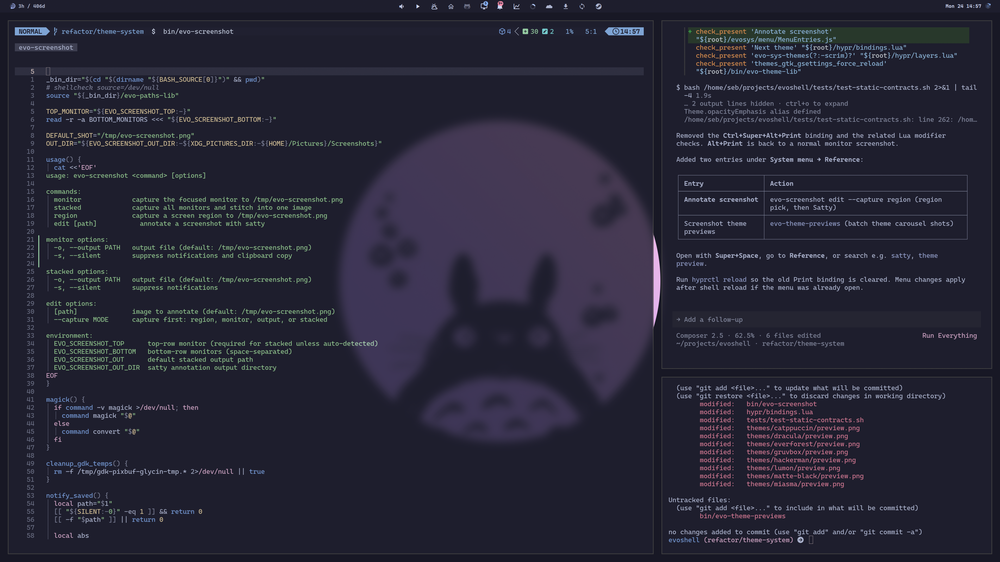](evoshell/themes/catppuccin/preview.png)

### Dracula
[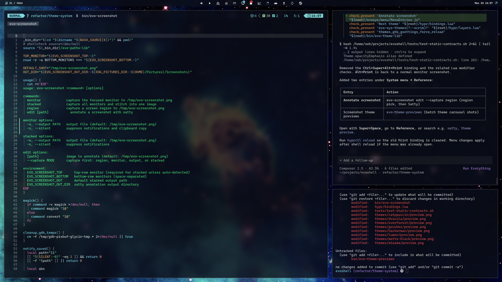](evoshell/themes/dracula/preview.png)

### Everforest
[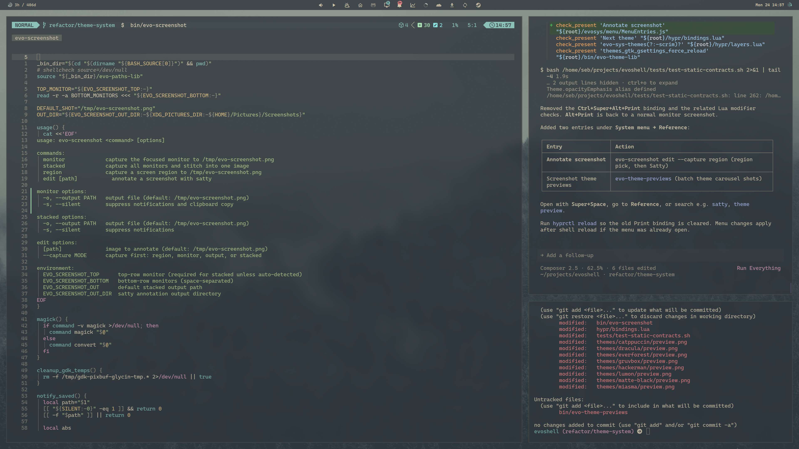](evoshell/themes/everforest/preview.png)

### Gruvbox
[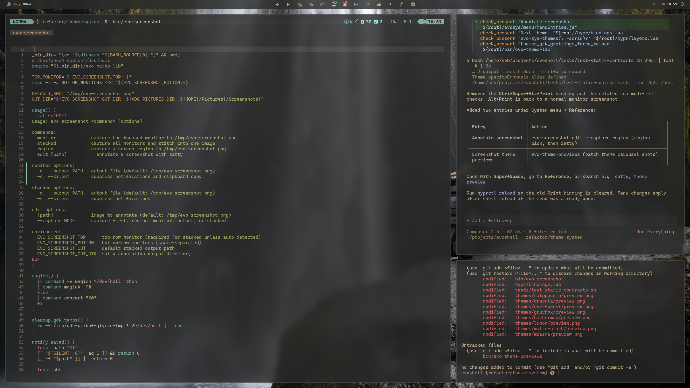](evoshell/themes/gruvbox/preview.png)

### Hackerman
[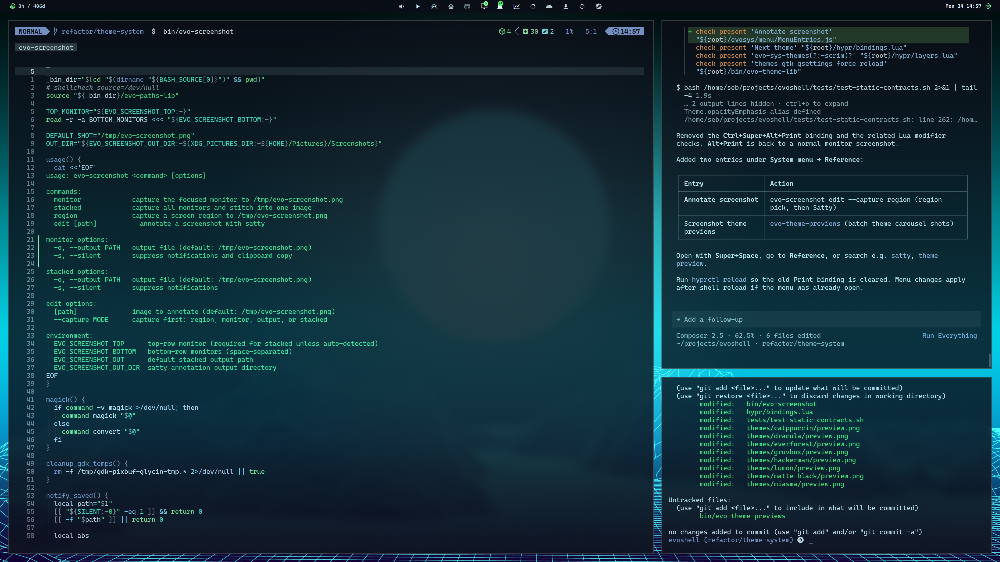](evoshell/themes/hackerman/preview.png)

### Matte Black
[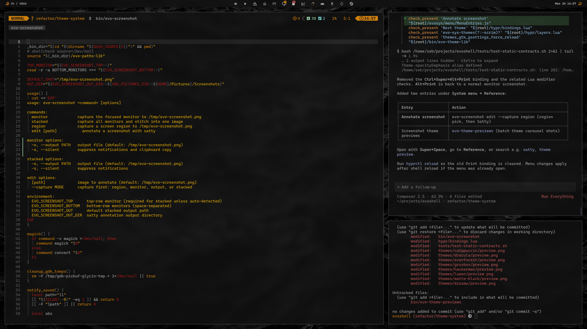](evoshell/themes/matte-black/preview.png)

### Miasma
[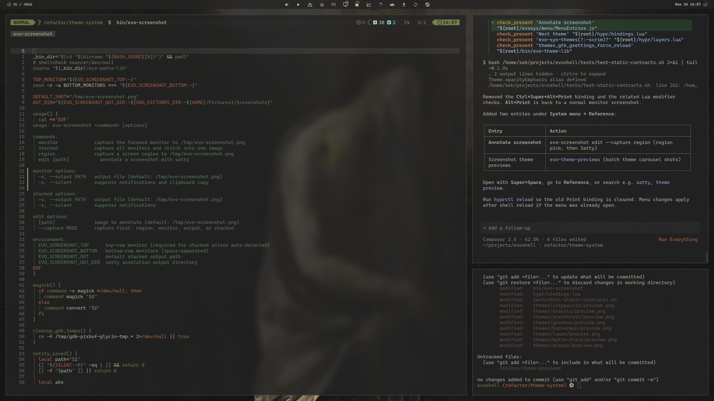](evoshell/themes/miasma/preview.png)

### Nord
[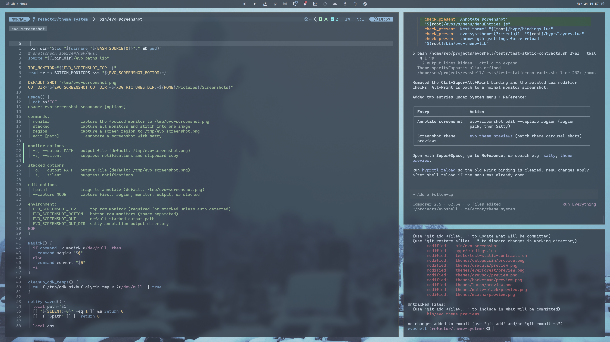](evoshell/themes/nord/preview.png)

### Lumon
[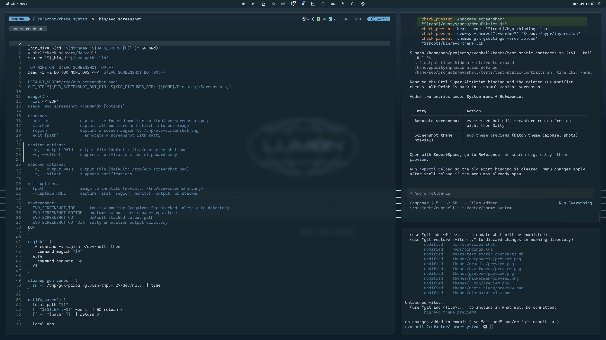](evoshell/themes/lumon/preview.png)

### Osaka Jade
[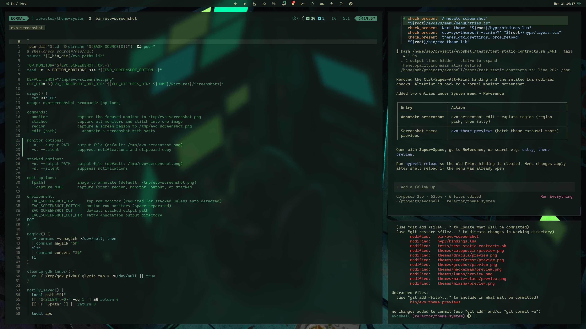](evoshell/themes/osaka-jade/preview.png)

### Tokyo Night
[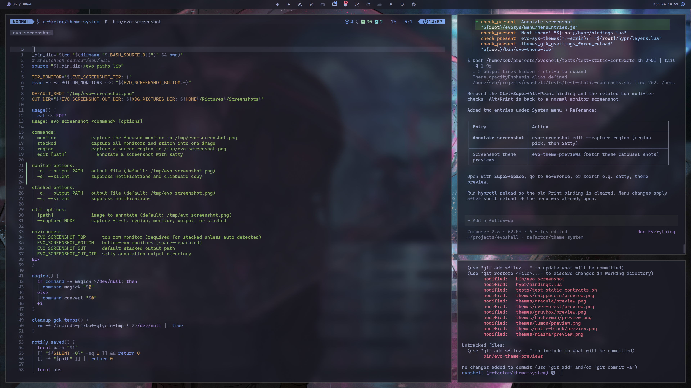](evoshell/themes/tokyo-night/preview.png)

### Vanta Black
[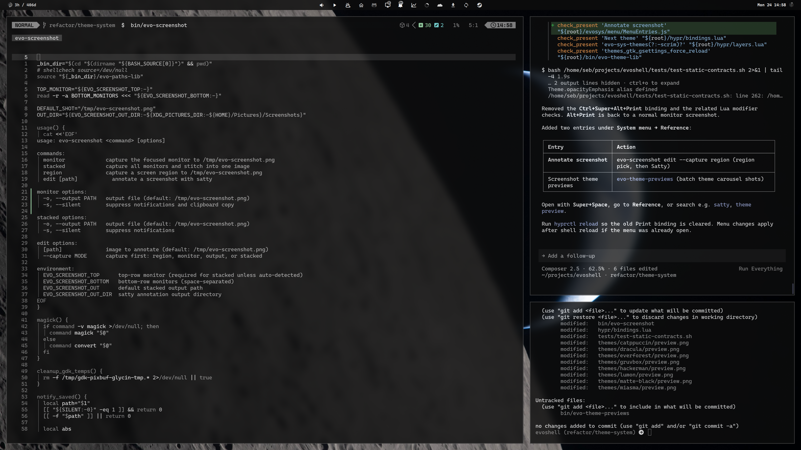](evoshell/themes/vantablack/preview.png)

## Configuration

`EVOSHELL_ROOT` is `evoshell/` in this checkout, recorded in `~/.config/evoshell/environment`.

| Layer | Path | Contents |
|-------|------|----------|
| Shell | `evoshell/shell.json` | Bar layout and per-monitor placement, notifications, idle, dashboards, Shopify, wallpaper |
| Settings | `$EVOSHELL_CONFIG/` (`~/.config/evoshell`) | `ui.json`, `font.json`, `hypr-looks.json` |
| State | `$EVOSHELL_STATE/` (`~/.local/state/evoshell`) | Session, `theme.json`, wallpaper, notification history, weather location |
| Cache | `$EVOSHELL_CACHE/` (`~/.cache/evoshell`) | Bar poller cache, menu thumbnails, chart history |
| Secrets | `pass` | API tokens under `evoshell/` |

`evo-config` writes `evoshell/shell.json`. `evo-layout` writes bar and notification placement there, and UI scale into `ui.json`. Settings in the system menu edits the same files. Do not put tokens in JSON.

## Dev

```bash
EVOSHELL_BIN=$PWD/evoshell/bin
evo system restart
journalctl --user -t evoshell -f
```

Plugin ids, IPC, and reload rules are in [AGENTS.md](AGENTS.md).
