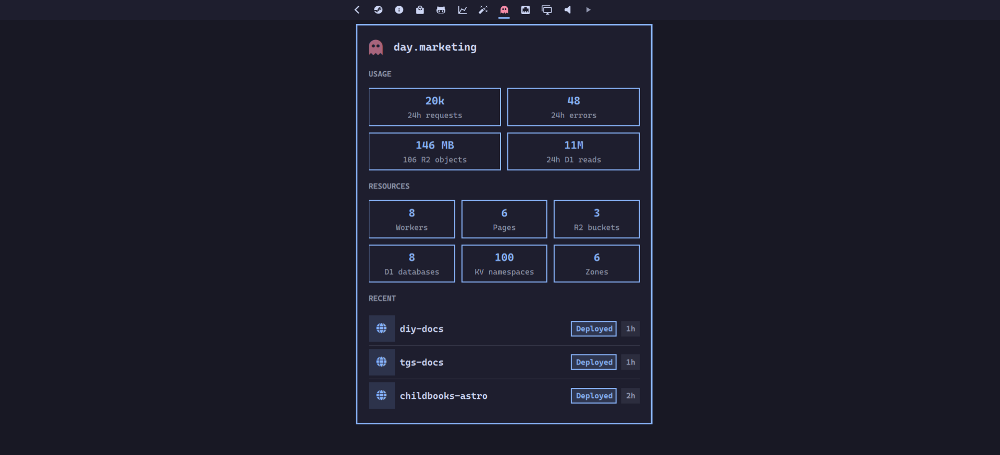

# Cloudflare



Bar widget for Cloudflare account resources, usage meters, recent deploys, and quick links into the dashboard.

This module ships with evoshell. The plugin id is `evo.cloudflare`.

## Requirements

- `curl` and `bash` on `PATH`
- `pass` for API token storage (optional if you only use the bar after manual setup)

## Auth

The bar loads a Cloudflare API token from:

```bash
pass insert evoshell/cloudflare/read-all
```

Use a token with read access to Workers, Pages, R2, D1, Queues, KV, and Zones. Cache purge actions need the Cache Purge permission on the relevant zone.

## Settings

Widget options live on the bar layout entry in `shell.json`:

```json
{
  "id": "evo.cloudflare",
  "refreshIntervalSec": 60,
  "analyticsIntervalSec": 900,
  "deployRows": 8,
  "overviewDeployRows": 3,
  "errorRatePercent": 1,
  "workerRequestsPerDay": 0,
  "r2StorageGb": 0,
  "d1RowsReadPerDay": 0,
  "projectsRoot": ""
}
```

Set usage limits above zero to show Workers requests, R2 storage, and D1 rows read as meters. `projectsRoot` overrides the default scan of `~/projects`, `~/src`, `~/dev`, and `~/code` for local Wrangler project paths.

## IPC

```bash
evo ipc shell toggle evo.cloudflare
evo ipc evo.cloudflare refresh
```

Removing the module does not delete:

- `pass` entry `evoshell/cloudflare/read-all`

Network: https://api.cloudflare.com and https://dash.cloudflare.com.
