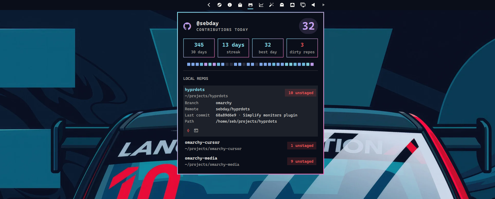

# GitHub



EvoShell bar widget for GitHub contributions: today's count, 30-day stats, an activity heatmap, and local dirty repos under folders you choose.

## Install

EvoShell discovers `modules/github/manifest.json` at startup. Add `{ "id": "evo.github" }` to a bar layout section in `shell.json` and run `evo system restart`.

## Requirements

- `curl`, `jq`, `git` and `bash`
- GitHub auth via `gh` or `pass` (see below)
- `cursor-agent` (or another supported agent) for the commit buttons

## Auth

Resolution order:

1. `gh auth token` (`gh` comes from mise and is on the session `PATH`)
2. `pass show evoshell/github/token`

```bash
gh auth login
# or
pass insert evoshell/github/token
```

## Settings

Inline on the `evo.github` bar entry:

| Key | Default | What it does |
|---|---|---|
| `refreshMinutes` | `15` | Background refresh interval for contributions and repos |
| `repoRoots` | unset | Folders to scan for dirty git repos (`~/` is expanded) |
| `agent` | `cursor-agent` | Agent for Commit: `cursor-agent`, `claude`, `codex` or `opencode` |

```json
{
  "id": "evo.github",
  "repoRoots": [
    { "path": "~/projects", "label": "projects" },
    { "path": "~/work", "label": "work" }
  ]
}
```

## Local repos

Without `repoRoots`, the panel detects `~/projects`, `~/Projects`, `~/work` and `~/Work` and asks which to scan. Saving writes `repoRoots` to the bar entry through `shell.updateEntryInline` (stored in `shell.json`).

Repos with local changes or unpushed commits appear in the panel. Expand a repo to commit, push, or open it in a terminal. Commit runs one headless agent turn (`bin/agent-prompt`) that reviews, stages and commits without pushing. `Commit all` and `Push all` work through the repos one after another. Results arrive as desktop notifications.

## IPC

```bash
evo ipc evo.github toggle
evo ipc evo.github refresh
evo ipc shell toggle evo.github
```

| Call | Action |
|---|---|
| `open` / `show` | Open the panel |
| `close` / `hide` | Close the panel |
| `toggle` | Toggle the panel |
| `refresh` | Refresh contributions and repos |

## Helpers

```bash
bin/github-status [--refresh]
bin/repo-dirty-status [--refresh] --roots '[{"path":"~/projects"}]'
bin/repo-settings detect
```

## Data

- `$EVOSHELL_CACHE/github/github.json`, `$EVOSHELL_CACHE/github/repo-dirty.json`
- `pass` entry `evoshell/github/token` (optional)

Network: https://api.github.com/graphql.
