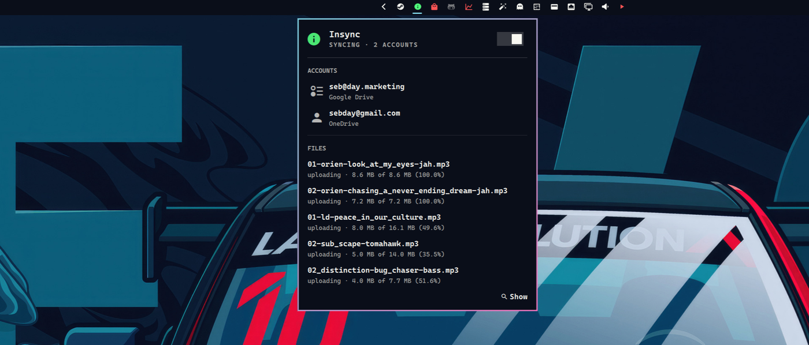

# Insync

EvoShell bar widget for [Insync](https://www.insynchq.com/) cloud sync: accounts, sync totals, and errors.

I use Insync to sync my Google Drive and One Drive accounts into Linux. I think it's well worth the one time fee as there is nothing open-source that works as well or reliably.



## Install

EvoShell discovers `modules/insync/manifest.json` at startup. Add `{ "id": "evo.insync" }` to a bar layout section and run `evo system restart`.

## Requirements

- Insync installed, with `insync` on `PATH`, and the daemon running (`insync start`)
- `jq` and `/usr/bin/python3`
- A Hypr rule that tags the Insync window `floating-window`, so middle-click opens it floating and centered. In `~/.config/hypr/windows.lua`:

```lua
hl.window_rule({
	name = "tag-floating-window-insync",
	match = { class = "^(Insync|insync)$" },
	tag = "+floating-window",
})
```

## Bar

| Click | Action |
|---|---|
| Left | Toggle the status panel |
| Middle | Show and focus the Insync window |

| State | Colour |
|---|---|
| Syncing, no errors | Accent |
| Errors or `ERROR` status | Urgent |
| Idle or paused | Foreground |

## Panel

- **Hero**: status, account count, and a pause/resume switch
- **Totals**: files synced, files syncing, combined size
- **Recent**: the last three files Insync finished syncing
- **Accounts**: email and provider for each linked cloud
- **Errors**: items from `insync error list` (skipped while paused)

The panel polls while it is open.

## IPC

```bash
evo ipc shell toggle evo.insync
evo ipc evo.insync refresh
```

| Call | Action |
|---|---|
| `open` / `show` | Open the panel |
| `close` / `hide` | Close the panel |
| `toggle` | Toggle the panel |
| `refresh` | Refresh status |

## Helper

```bash
bin/insync-status popup|account-cache|pause|resume|show
```

## Data

- `$EVOSHELL_CACHE/insync/accounts.json`

Network: none (local Insync CLI and database only).
