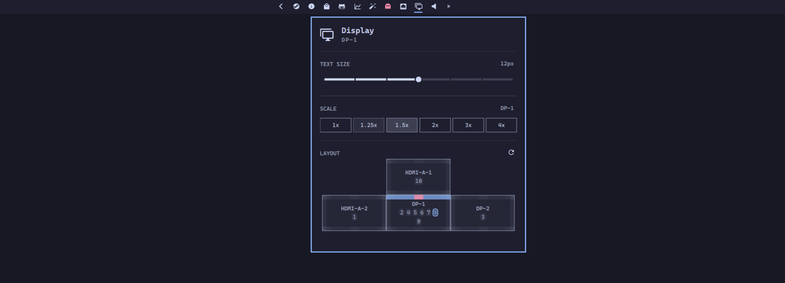

# Monitors



Status bar, notification daemon, and per-monitor layout controls in one plugin.

This module ships with evoshell. The plugin id is `evo.monitors`. It provides `evo.sys.notifications`.

## Panel

Add the Monitors widget to the bar layout (`evo.monitors`) to open the panel. From there you can:

- Adjust brightness and scale per output
- Toggle bar and notification placement per monitor
- Reset layout to the default bar and notification placement

## IPC

```bash
evo ipc shell toggle evo.monitors
evo ipc notifications toggleDnd
evo ipc notifications showHistory
```

Removing the module does not delete:

- `~/.local/state/evoshell/monitors/notifications/`

Network: none.
