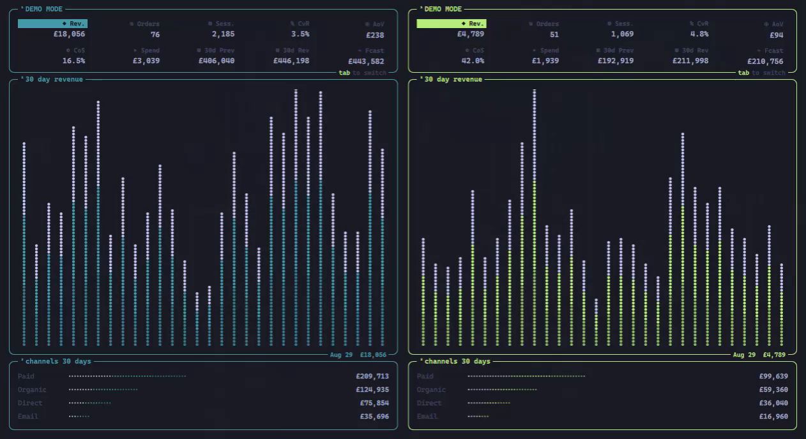

# evoshopify



Shopify store revenue. Today's KPIs and a dotted chart for every store in the data source.

This module ships with evoshell. Open it with Super+Alt+S, or:

```bash
evo ipc shell toggle evo.shopify
```

## Requirements

- `jq` and `curl` on `PATH`
- `pass show evoshell/ecommerce-data/api-token`

### Worker API

```json
"shopify": {
  "apiUrl": "https://data.day.marketing",
  "pollIntervalMinutes": 5,
  "timezone": "Europe/London",
  "stores": [
    { "key": "DIY", "title": "DIY" },
    { "key": "TGS", "title": "TGS" }
  ]
}
```

`apiUrl` points at the Worker and must be `https://`. Auth is bearer-only from `pass show evoshell/ecommerce-data/api-token`.

On each refresh `shopify-status` posts `/v1/sync/today` (1-day Shopify/Ads/GA4, at most every 4 minutes), then reads `GET /v1/sites/:site/kpi/summary`. Stores come from `GET /v1/sites` when `stores` is omitted.

Store borders follow the current theme: cyan, bright green, blue, yellow, magenta. DIY is cyan and TGS is blue.

## Panel

| Key | Action |
|---|---|
| `q` / `esc` | Close |
| `r` | Refresh |
| Tab / Shift+Tab | Next / previous stat |
| `n` / `p` | Next / previous store |

Click a stat to chart it. Close the window, or press `q` or `esc`.

The panel runs `bin/shopify-status` for data and `bin/panel-config` for the poll interval and theme colours. Both go through `bin/panel-run`, which caps output and kills the command when the panel closes.

Removing the module does not delete:

- `~/.cache/evoshell/shopify/bar/`
- `~/.cache/evoshell/shopify/icons/`
- `pass` entry `evoshell/ecommerce-data/api-token`

Network: the configured HTTPS worker origin.
