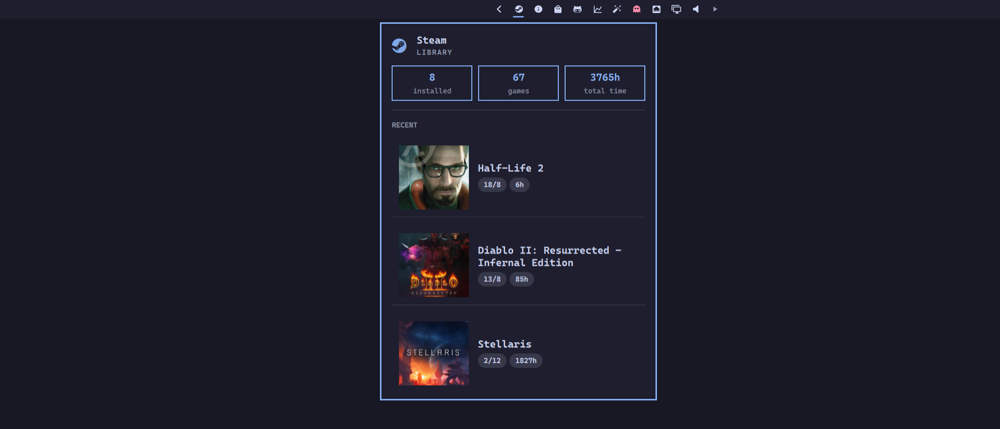

# Steam

EvoShell bar widget for Steam: installed vs owned games, lifetime playtime, and recent titles.



## Install

EvoShell discovers `modules/steam/manifest.json` at startup. Build the helper, add `{ "id": "evo.steam" }` to a bar layout section, and run `evo system restart`.

```bash
make -C modules/steam        # uses go from PATH, else `mise exec go -- go`
```

The build writes `bin/steam-status` (static, gitignored). Rebuild after pulling Go changes.

## Requirements

- Go (build only), from mise or the system
- Steam with a library under `~/.local/share/Steam` (override with `STEAM_DIR`)
- `steam` on `PATH` for launching games (override with `STEAM_BIN`)

Middle-click opens Steam through `gtk-launch steam` (wrapped in `uwsm-app` when present), the same way the app launcher does.

## IPC

```bash
evo ipc shell toggle evo.steam
evo ipc evo.steam refresh
```

| Call | Action |
|---|---|
| `open` / `show` | Open the panel |
| `close` / `hide` | Close the panel |
| `toggle` | Toggle the panel |
| `refresh` | Refresh status |

## Helper

```bash
bin/steam-status popup|launch <appid>|open
```

Network: none (local Steam files only).
