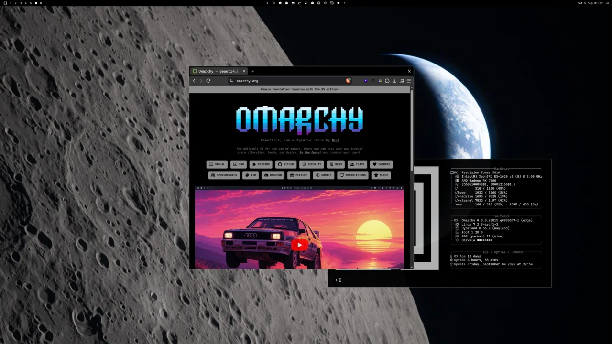
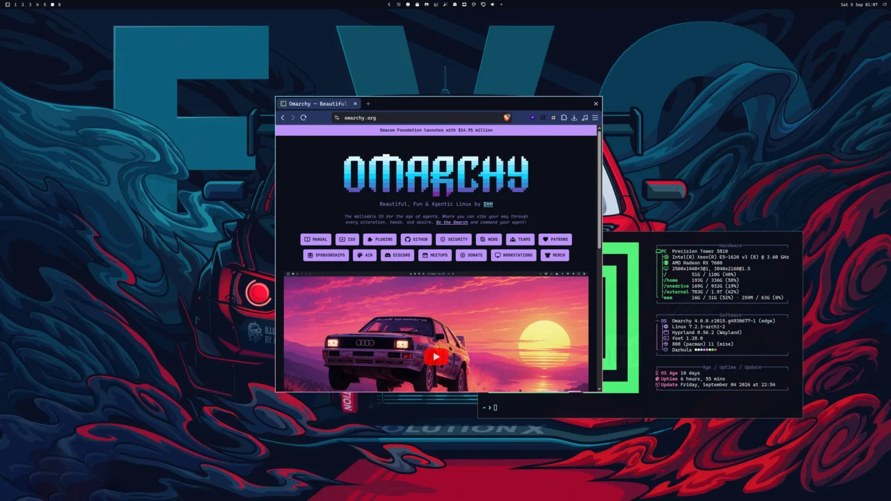
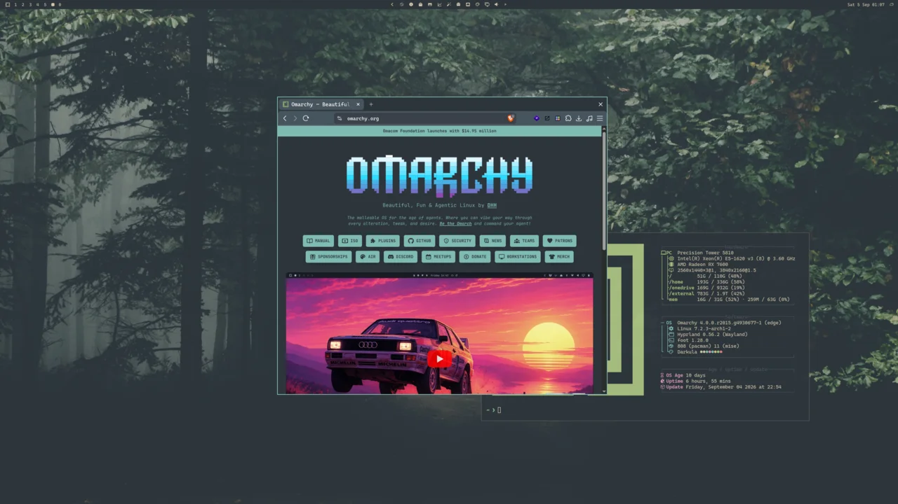

<p>
  <a href="docs/omarchy-org-moon-full.webp"></a>
  <a href="docs/omarchy-org-evo-full.webp"></a>
  <a href="docs/omarchy-org-forest-full.webp"></a>
</p>

# Webtheme

Style any website in Brave/Chromium to match the active theme. Websites switch colour scheme along with the theme.

This module ships with evoshell. Click **Install browser integration** in the panel (or run `webtheme setup`) and restart the browser to pick up the extension.

The module ships a small unpacked MV3 extension and appends it to the existing `--load-extension=` line in Chromium/Brave flags.

`themed/colors.css.tpl` turns the active palette into CSS variables (`--bg-primary`, `--text-accent`). A theme-set hook copies that file into the unpacked extension and bumps a revision stamp. The content script watches the stamp, then injects `colors.css` plus the matching site's `style.css` into the tab.

## Requirements

- `bash` and `jq`
- Brave and/or Chromium using `~/.config/brave-flags.conf` / `~/.config/chromium-flags.conf`

## New sites

Use the button in the extension or ask your agent to theme a site. 

Bundled packages live in `sites/<id>/` in this repo. Your own packages (and overrides) go in `~/.config/evoshell/webtheme/sites/<id>/` so updates do not clobber them.

```
sites/github/
  site.json
  style.css
```

```json
{
  "id": "github",
  "name": "GitHub",
  "matches": ["https://github.com/*"],
  "enabled": true
}
```


Drop a new folder into `~/.config/evoshell/webtheme/sites/` and run:

```bash
webtheme assemble
```

## CLI

```bash
webtheme setup          # assemble + flags + theme-set hook (explicit panel action or CLI)
webtheme assemble       # rebuild runtime extension
webtheme list           # JSON {enabled, sites}
webtheme enabled [true|false]
webtheme save           # write a user site package from JSON on stdin
webtheme theme-site [--launch] <url> [title]
```

Removing the module does not delete:

- `~/.config/evoshell/webtheme/`
- `~/.local/share/evoshell/webtheme/`
- theme-set hook `~/.config/evoshell/hooks/theme-set.d/webtheme.hook`
- native-messaging manifests under Brave/Chromium config
- browser flag lines that load the unpacked extension

Network: none at runtime; the extension injects CSS into matching tabs.
